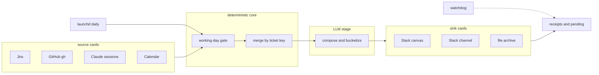

# 👻 Standup Ghost

**Never write a standup again.** A Claude Code plugin that composes and posts your daily standup from what you *actually did* — your Jira tickets, your GitHub PRs, your Claude Code sessions, your calendar — every working day, unattended.

> ⚠️ **macOS-only in v1** (the scheduler is launchd). Linux/Windows: the pipeline works interactively; contribute a scheduler card!

## What it posts

```
## 🗓️ Thu 2026-07-16 — you
**Yesterday**
- Payments: shipped PROJ-42 retry logic (repo#123, repo#124), CI green
- Platform: root-caused the flaky deploy (PROJ-57); filed PROJ-61
- (Calls: incident review, API design sync)
**Today**
- Payments: land PROJ-43; start PROJ-61
- Reviews: 6 PRs
- (Calls: quarterly planning)
```

Terse by design: two blocks, one line per initiative, meetings without a ticket in brackets, everything linked, **no Blockers section**. All knobs in config.

## How it works



| Piece | What it does |
|---|---|
| **Source cards** (`cards/sources/`) | One markdown file per source: probe + fetch recipe + output contract. Dark lane = fewer bullets + a flag, never a dead run, never invented content. |
| **Working-day gate** | Weekends, OOO, sick leave, vacation, company holidays (from your calendar, configurable patterns) ⇒ the run skips cleanly, and the NEXT run's "Yesterday" stretches back to your last actual working day. |
| **Compose (LLM)** | Merges everything by ticket key, bucketizes per initiative, formats. The date always comes from `date`, never model memory. |
| **Sink cards** (`cards/sinks/`) | Slack canvas (multi-writer safe, replace-not-duplicate), Slack channel (edit-via-`ts`, backlog collapsed to one message), local file archive. Delivery failure ⇒ typed pending, flushed on next success — a composed standup is never lost. |
| **Scheduler** | launchd daily job + an independent **watchdog** job. Version drift, no-post days, stuck pending — all surface as macOS notifications. Silent failure is a designed-out state. |

## Install

Prerequisites (the doctor checks all of this and tells you exactly what's missing):
- Claude Code with the connectors you want: Slack (canvas/channel), Atlassian (Jira), Google Calendar — each is its own OAuth, budget a few minutes apiece
- GitHub lane: **your choice** of `gh` CLI *or* the GitHub MCP server (setup probes both and asks)
- `node` ≥ 20

```bash
claude plugin marketplace add jerry7991/standup-ghost
claude plugin install standup-ghost
```

Then, inside Claude Code:

```
/standup-ghost:setup
```

The wizard collects your config, probes which connector flavors your machine has, dry-runs with your real data (showing exactly where it will post, by name), makes the first real post, and hands you ONE paste to install the schedule. Setup only declares itself done after a real calendar-fired run has posted.

## Daily verbs

| Verb | What |
|---|---|
| `/standup-ghost:standup` | Full run (the scheduler calls this) |
| `/standup-ghost:standup dry-run` | Compose only, write to the local file sink |
| `/standup-ghost:standup post` | Approve today's held draft (review mode) |
| `/standup-ghost:doctor` | Full diagnosis — one table, exact remediations |
| `/standup-ghost:doctor pause` / `resume` | Going on leave without calendar events? Pause cleanly. |
| `/standup-ghost:recap month` (or `quarter`, `half`, `2026-01-01..2026-03-31`) | TLDR of what you shipped — built from your local archive; appraisal season in one command |
| `/standup-ghost:recap find <query>` | Search your work history: when/where a topic appeared, dated + linked |
| `/standup-ghost:recap team` / `recap sprint` | On-demand only: team digest read from the shared canvas / current-sprint slice. Nothing recap-related ever runs automatically or auto-posts. |

## Configuration

Copy `config.example.json` to `~/.config/standup-ghost/config.json` (setup does this for you). Highlights:

| Key | Meaning |
|---|---|
| `schedule` | Days + time (local) — changing it regenerates the launchd jobs |
| `sources.*` / `sinks.*` | Enable flags + per-card settings (JQLs, canvas/channel IDs) |
| `absence.*` | OOO event types, leave/sick/holiday title patterns, company-holiday calendar IDs, `auto_skip` |
| `format.*` | Heading, bucket hints, max lines, lookback floors |
| `behavior.*` | `review_mode` (draft-to-DM before posting), `notify_on_post`, min-content gate, pending expiry, alarm threshold |

## Gotchas (battle-tested, dated — read before filing an issue)

- **launchd + TCC (2026-07-16):** background jobs cannot read `~/Desktop`/`~/Documents`. The runtime lives in `~/.local/share/standup-ghost` — never move it to Desktop.
- **Powered-off days:** launchd fires a missed run when the Mac *wakes*, but not if it was *off* at trigger time. Off all day = skipped day (the watchdog will tell you).
- **Slack canvas API drift (2026-07-16):** parameterless prepend was rejected; replace-without-section-id wipes canvases. The canvas card encodes the current verified semantics and read-back-verifies every write. If Slack drifts again, file an issue with the error.
- **Notifications:** macOS may silently suppress `osascript` notifications until you allow them (System Settings → Notifications). Setup fires a test one and asks if you saw it.
- **Headless connectors (READ THIS if scheduled Slack posts aren't landing):** the scheduled `claude -p` run **cannot authenticate interactive claude.ai connectors** (Slack, Google Calendar, Atlassian) — they work when you run interactively but go dark on a schedule. Sources degrade gracefully (thinner bullets + a flag); a dark Slack **sink** means nothing posts (held as `failed` pending, alarm fires). Fix: use a **token flavor** — the transport that needs no interactive OAuth, exactly like the github `cli` flavor.
  - **Slack (`flavors.slack: "token"`):** put a bot token in `~/.config/standup-ghost/secrets.json` (`chmod 600`, copy `secrets.example.json`) with scopes `canvases:read`+`canvases:write` (canvas) / `chat:write` (channel); the bot must be a member of the canvas/channel. Delivery then goes through `runtime/lib/slack.js` over the Slack Web API — proven headless. `claudeai` stays available for interactive-only use.
  - Google Calendar has no token flavor yet — headless runs fall back to a weekday-only working-day gate. Jira dark headless just thins content.
- **`gh search` quoting:** the positional `org:… updated:…` form breaks; the github card uses flag form only.

## Contributing a card

A new source or sink = **one markdown file** — read `cards/CONTRACT.md`. The `cards/sinks/file.md` demo sink was written strictly against that contract with zero core changes; yours can be too. Security: declared tools must sit inside the per-kind enum in `runtime/lib/cards.js` (widening it is a reviewed change), and only `reviewed: true` cards merged via PR run by default.

## Development

```bash
node --test test/*.test.js   # 36 unit tests
zsh test/run-smoke.sh        # runner/watchdog smoke with mocked claude
./scripts/scan-identifiers.sh  # release gate: no private identifiers ship
```

The scan gate ships only generic patterns. Put YOUR company/personal strings (org names, channel/canvas IDs, emails) in `~/.config/standup-ghost/private-patterns.txt` — one regex per line, part of your local profile, never committed. `.scan-patterns.local` works repo-locally (gitignored) too.

MIT © [jerry7991](https://github.com/jerry7991)
